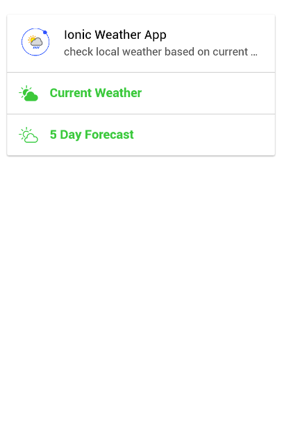
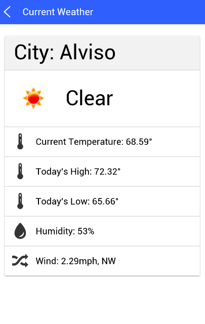

# Ionic OpenWeather App 

 

Ionic OpenWeather App is a simple ionic hybrid app utilizing AngularJS, Cordova, Ionic Framework and OpenWeatherMap API.

### Building and Run App

Install Cordova, Ionic with NPM, clone the ionic-openweather-app project, then run:

```bash
$ cd ionic-openweather-app
$ ionic platform add android
$ ionic build android
$ ionic emulate android
```
You can also try the pre-built Android APK (IonicCordovaWeatherApp.apk) under ionic-openweather-app/dist directory.

### [Ionic "Cards"](http://ionicframework.com/docs/components/#cards)

As cards style has been widely adopted, Ionic OpenWeather App is using Ionic CSS Component "Cards" to render its main "home" page and "current weather" page:

 

### [OpenWeatherMap Web API](http://openweathermap.org/api)

Ionic OpenWeather App is fetching local weather based on geo location ({lat: 37.41, lng: -122.08}) from [OpenWeatherMap.org](http://openweathermap.org/), you can fetch your current local weather data using the longitude and latitude, the result would be like:

```javascript
{ "coord":   {"lon":-122.08, "lat":37.41},
  "sys":     {"type":1, "id":451, "message":0.4839, "country": "United States of America", "sunrise":1406812347, "sunset":1406863010},
  "weather": [{"id":802,"main":"Clouds","description":"scattered clouds","icon":"03d"}],
  "base":    "cmc stations",
  "main":    {"temp":296.81,"pressure":1015,"humidity":77,"temp_min":288.15,"temp_max":303.15},
  "wind":    {"speed":2.6,"deg":0},
  "clouds":  {"all":40},
  "dt":      1406833786,
  "id":      5375480,
  "name":    "Mountain View",
  "cod":     200
}
``` 

### TODO

Integrate Cordova GeoLocation Plugin with Ionic OpenWeather App

